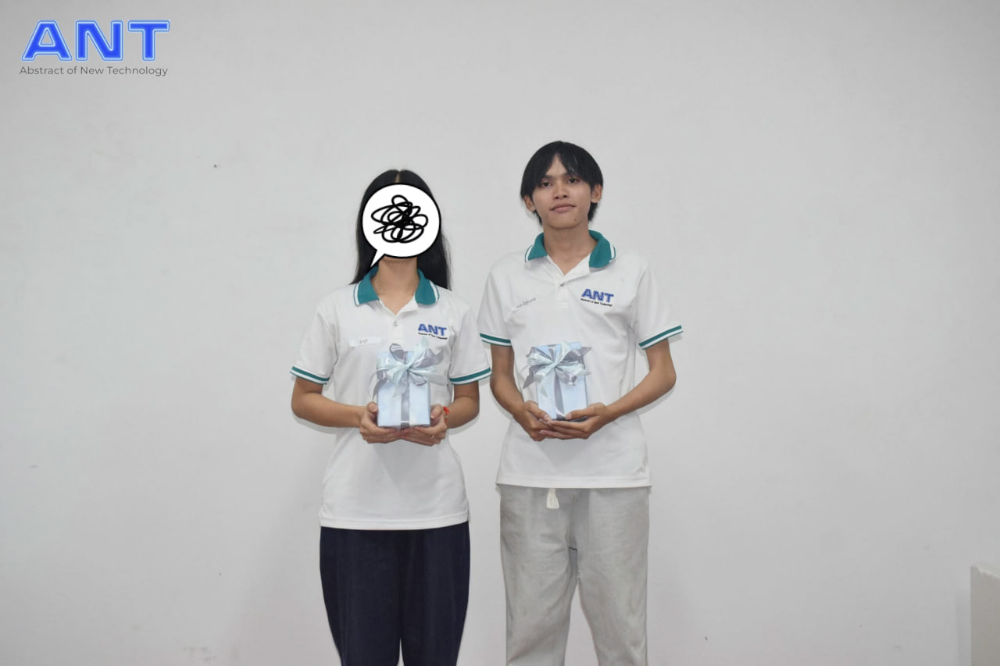
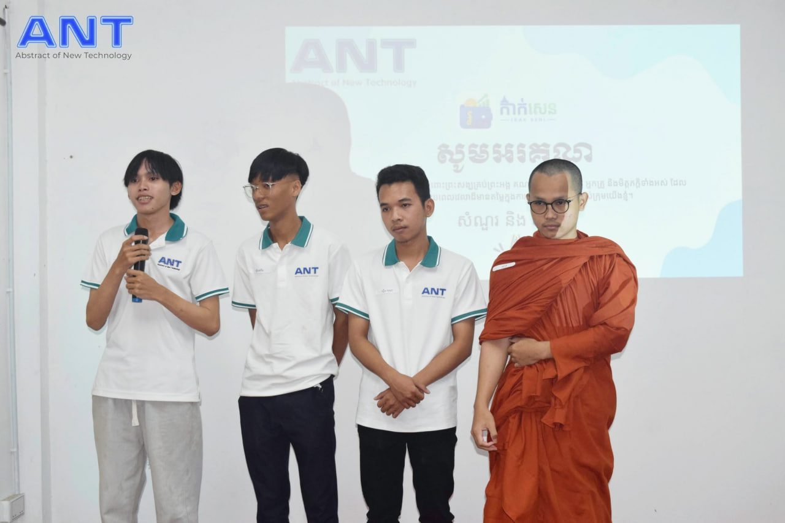
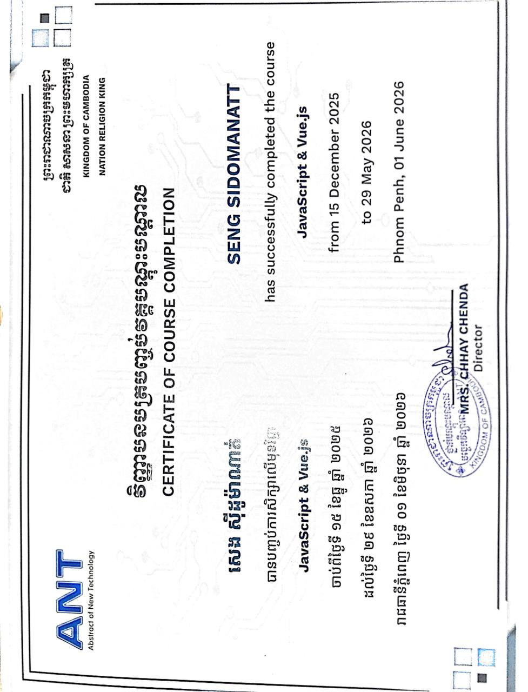
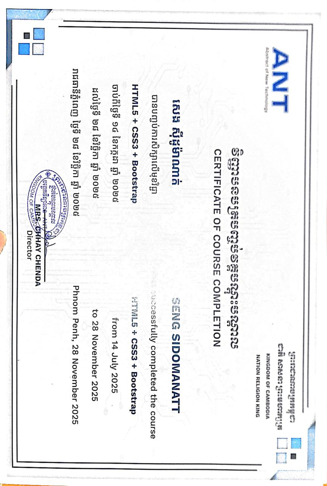
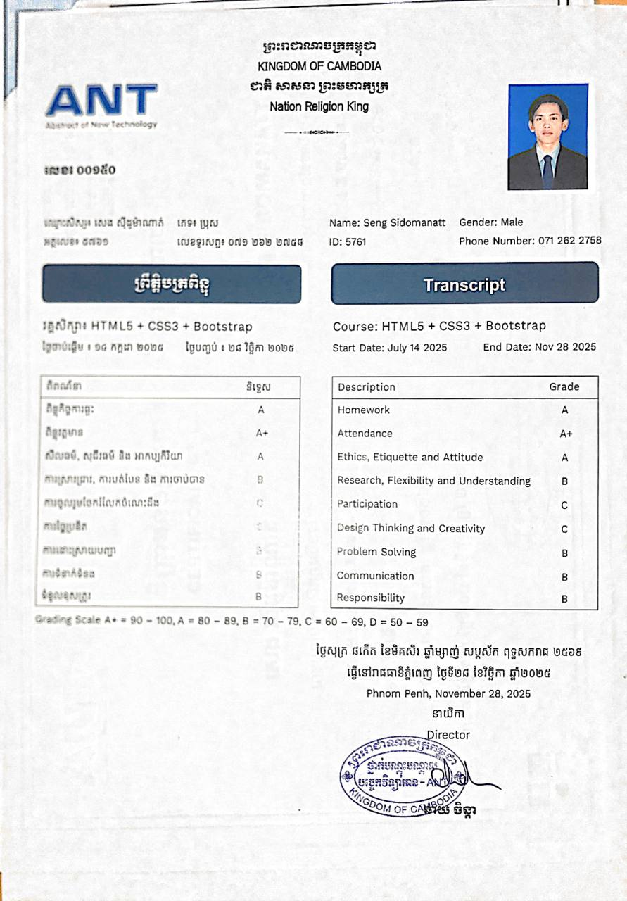

  
  
  

٭ ⋆｡°✩₊˚｡𓆙 ***inspired by the Naga of Angkor — guardian of rivers, wisdom & the web I build*** 𓆙｡˚₊✩°｡⋆ ٭

 

## 👨‍💻 About Me

I'm a passionate web developer who enjoys building responsive websites and RESTful APIs. I'm continuously sharpening my frontend and backend skills while shipping real-world projects.

- 🌱 Currently learning **Node.js, Express.js, MySQL, Vue.js**
- 💻 Interested in **Full-Stack Web Development**
- 🚀 Love building clean, user-friendly web applications
- 📚 Always exploring new technologies
- 🏅 Recognized as **Team Leader** at ANT (Abstract of New Technology) — trusted to guide and support my teammates through the course

 

## 🛠️ Tech Stack

<table align="center">
<tr>
<td align="center" valign="top" width="25%">

**Frontend**

  
HTML5 · CSS3 · Bootstrap JavaScript · Vue.js

</td>
<td align="center" valign="top" width="25%">

**Backend**

  
Node.js · Express.js REST API

</td>
<td align="center" valign="top" width="25%">

**Database**

  
MySQL

</td>
<td align="center" valign="top" width="25%">

**Tools**

  
Git · GitHub · VS Code Postman · MySQL Workbench

</td>
</tr>
</table>

 

## 🚀 Featured Project

### 🌐 Personal Portfolio
A responsive personal portfolio showcasing my skills, projects, and contact information.

 

##  

** Team Leader **
Recognized for strong leadership and guiding my team throughout the course.

  

**🎤 Project Presentation**
Presenting our group project at ANT alongside my teammates.

 

## 📜 Certifications

<table>
<tr>
<td align="center" width="33%">

**JavaScript & Vue.js**
 Dec 2025 – May 2026
 

</td>
<td align="center" width="33%">

**HTML5 + CSS3 + Bootstrap**
 Jul 2025 – Nov 2025
 

</td>
<td align="center" width="33%">

**Course Transcript**
 HTML5 + CSS3 + Bootstrap
 

</td>
</tr>
</table>

 

## 📈 GitHub Stats

 

## 📫 Contact

| 🌐 Portfolio | 📧 Email | 💼 GitHub |
|:---:|:---:|:---:|
| [seng-sidomanatt-web.netlify.app](https://seng-sidomanatt-web.netlify.app/) | [sengsidomanatt@gmail.com](mailto:sengsidomanatt@gmail.com) | [@Seng Sidomanatt](https://github.com/gjg86271-dev) |

 

## 💡 Quote

> *"Code. Learn. Build. Repeat."*

 

⭐ **Thanks for visiting my profile!** ⭐

